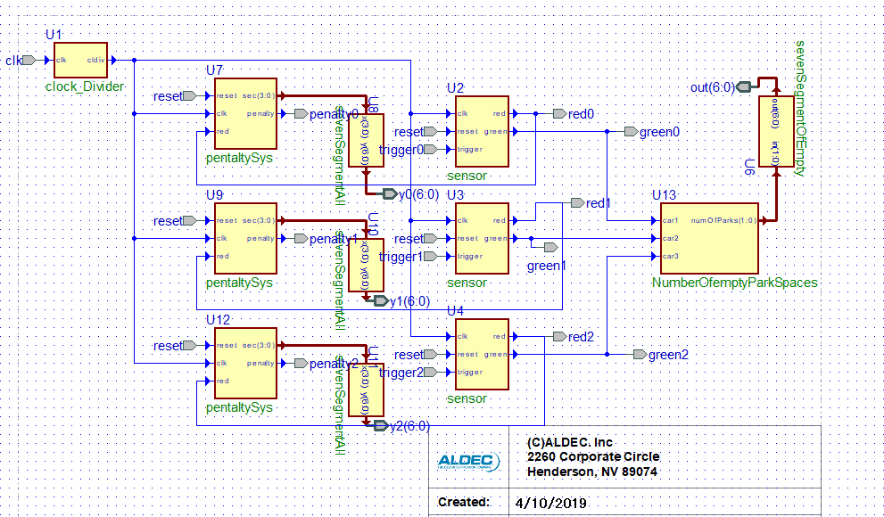
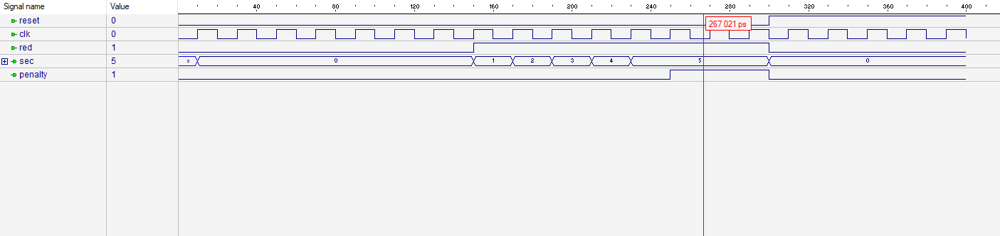
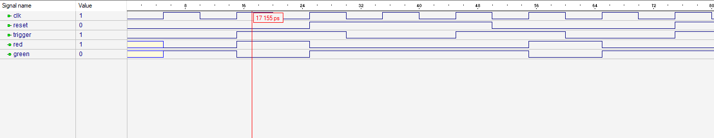
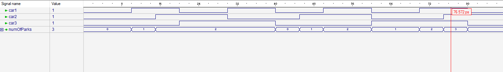

# project idea
It is a private car parking facility with fines and penalties system.\
when a car reaches the parking space a sensor is activated and a counter that keeps track of the number of empty parking spaces gets incremented and a countdown of x seconds starts,
when the time is up the car gets a fine "penalty" for parking for a long time.\

### Block diagram:

- Green means the parking space is empty.
- Red means the parking space is full

### Simulation main blocks:
- **PenaltySys**

- **Sensor:**

- **NumberOfEmptyParkSpaces:**

